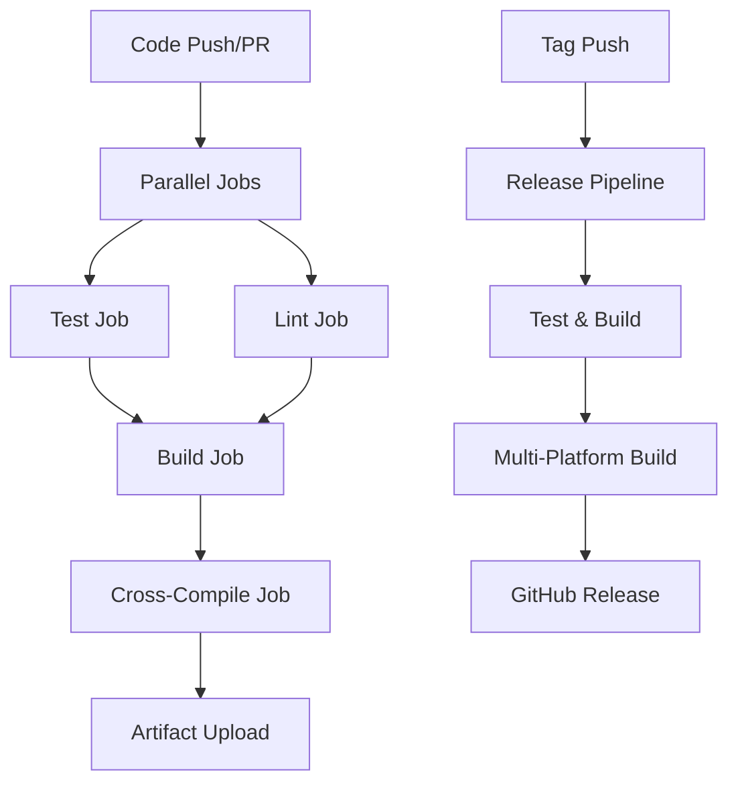
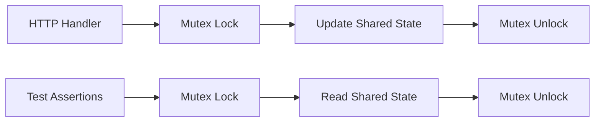

# Design Document

## Overview

This design addresses the comprehensive fixes needed for the TeraFetch CI/CD pipeline to resolve race conditions, linting issues, build failures, and missing platform-specific artifacts. The solution involves updating test synchronization, modernizing linter configuration, enhancing build processes, and optimizing pipeline performance.

## Architecture

### Pipeline Structure


### Test Synchronization Architecture


## Components and Interfaces

### 1. Test Race Condition Fixes

**Component:** Thread-Safe Test Infrastructure
- **Interface:** Mutex-protected shared variables
- **Implementation:** 
  - Add `sync.Mutex` for `requestCount` and `rangeRequests`
  - Protect all read/write operations with mutex locks
  - Ensure atomic access patterns in test handlers

**Files Modified:**
- `downloader/engine_test.go`

**Key Changes:**
```go
type testState struct {
    mu           sync.Mutex
    requestCount int
    rangeRequests []string
}

func (ts *testState) incrementCount() {
    ts.mu.Lock()
    defer ts.mu.Unlock()
    ts.requestCount++
}

func (ts *testState) addRangeRequest(rangeHeader string) {
    ts.mu.Lock()
    defer ts.mu.Unlock()
    ts.rangeRequests = append(ts.rangeRequests, rangeHeader)
}
```

### 2. golangci-lint Configuration Modernization

**Component:** Linter Configuration Manager
- **Interface:** YAML configuration with modern linters
- **Implementation:**
  - Remove deprecated linters: `shadow`, `deadcode`, `structcheck`, `varcheck`, `maligned`
  - Update output format configuration
  - Add proper test file exclusions
  - Configure appropriate timeout and performance settings

**Files Modified:**
- `.golangci.yml`

**Key Configuration Updates:**
```yaml
linters:
  enable:
    # Remove deprecated linters, keep modern ones
    - errcheck
    - gosimple
    - govet
    - ineffassign
    - staticcheck
    - typecheck
    - unused
    # ... other modern linters

  disable:
    - prealloc  # Keep only non-deprecated disabled linters

output:
  formats:
    - format: colored-line-number  # Use supported format
  sort-results: true
```

### 3. CI/CD Pipeline Enhancement

**Component:** GitHub Actions Workflow Manager
- **Interface:** YAML workflow definitions
- **Implementation:**
  - Update Go version to 1.25.x
  - Fix golangci-lint action configuration
  - Enhance caching strategies
  - Improve error handling and reporting

**Files Modified:**
- `.github/workflows/ci.yml`
- `.github/workflows/build.yml`

### 4. Cross-Platform Build System

**Component:** Multi-Platform Binary Generator
- **Interface:** Matrix build strategy
- **Implementation:**
  - Support Linux, macOS, Windows, FreeBSD
  - Generate amd64 and arm64 architectures
  - Proper binary naming with extensions
  - Optimized build flags

**Build Matrix:**
```yaml
strategy:
  matrix:
    include:
      - goos: linux
        goarch: amd64
      - goos: linux
        goarch: arm64
      - goos: darwin
        goarch: amd64
      - goos: darwin
        goarch: arm64
      - goos: windows
        goarch: amd64
      - goos: windows
        goarch: arm64
      - goos: freebsd
        goarch: amd64
```

## Data Models

### Test State Model
```go
type TestState struct {
    mutex         sync.RWMutex
    requestCount  int
    rangeRequests []string
    errors        []error
}
```

### Build Configuration Model
```yaml
BuildConfig:
  platforms:
    - os: string
      arch: string
      extension: string
  flags:
    - ldflags: string
    - tags: []string
  output:
    directory: string
    naming: string
```

### Pipeline State Model
```yaml
PipelineState:
  jobs:
    test:
      status: string
      coverage: float
    lint:
      status: string
      issues: int
    build:
      status: string
      artifacts: []string
```

## Error Handling

### Test Race Conditions
- **Detection:** Use Go race detector (`-race` flag)
- **Prevention:** Mutex synchronization for shared state
- **Recovery:** Fail fast with clear error messages
- **Logging:** Detailed race condition reports

### Linting Issues
- **Detection:** golangci-lint configuration validation
- **Prevention:** Use only supported linters and formats
- **Recovery:** Automatic configuration updates
- **Reporting:** Clear linter error messages with suggestions

### Build Failures
- **Detection:** Compilation error capture
- **Prevention:** Dependency verification and caching
- **Recovery:** Retry mechanisms for transient failures
- **Artifacts:** Preserve build logs and intermediate files

### Platform-Specific Issues
- **Detection:** Per-platform build validation
- **Prevention:** Matrix testing across platforms
- **Recovery:** Platform-specific fallback strategies
- **Compatibility:** Version compatibility checks

## Testing Strategy

### Unit Tests
- **Race Detection:** All tests run with `-race` flag
- **Coverage:** Maintain >80% coverage across packages
- **Isolation:** Each test uses independent temporary directories
- **Mocking:** HTTP servers for integration testing

### Integration Tests
- **End-to-End:** Complete download workflows
- **Platform Testing:** Cross-platform compatibility
- **Performance:** Benchmark critical paths
- **Stress Testing:** High concurrency scenarios

### CI/CD Testing
- **Pipeline Validation:** Test workflow syntax and logic
- **Artifact Verification:** Ensure all binaries are generated
- **Release Testing:** Validate release process
- **Rollback Testing:** Ensure pipeline can recover from failures

## Performance Optimizations

### Caching Strategy
```yaml
Cache Layers:
  - Go Modules: ~/.cache/go-build, ~/go/pkg/mod
  - golangci-lint: ~/.cache/golangci-lint
  - Dependencies: go.sum hash-based
  - Build Cache: Platform-specific build artifacts
```

### Parallel Execution
- **Test Jobs:** Run tests and linting in parallel
- **Build Matrix:** Parallel cross-platform compilation
- **Artifact Upload:** Concurrent artifact processing
- **Resource Optimization:** Efficient runner utilization

### Build Optimization
```bash
Build Flags:
  -ldflags="-s -w -X main.version=${VERSION}"
  -trimpath
  -buildmode=exe (Windows)
  CGO_ENABLED=0 (for static binaries)
```

## Security Considerations

### Dependency Security
- **Verification:** `go mod verify` before builds
- **Scanning:** Automated vulnerability scanning
- **Updates:** Regular dependency updates
- **Isolation:** Sandboxed build environments

### Artifact Security
- **Signing:** Code signing for release binaries
- **Checksums:** SHA256 checksums for all artifacts
- **Verification:** Automated integrity checks
- **Distribution:** Secure artifact storage and delivery

### Pipeline Security
- **Permissions:** Minimal required permissions
- **Secrets:** Secure secret management
- **Isolation:** Job isolation and cleanup
- **Audit:** Pipeline execution logging

## Monitoring and Observability

### Pipeline Metrics
- **Build Times:** Track compilation performance
- **Test Coverage:** Monitor coverage trends
- **Failure Rates:** Track pipeline reliability
- **Artifact Sizes:** Monitor binary size growth

### Quality Metrics
- **Linting Issues:** Track code quality trends
- **Test Reliability:** Monitor flaky tests
- **Performance:** Benchmark regression detection
- **Dependencies:** Track dependency health

### Alerting
- **Pipeline Failures:** Immediate notifications
- **Coverage Drops:** Quality degradation alerts
- **Security Issues:** Vulnerability notifications
- **Performance Regressions:** Performance alerts